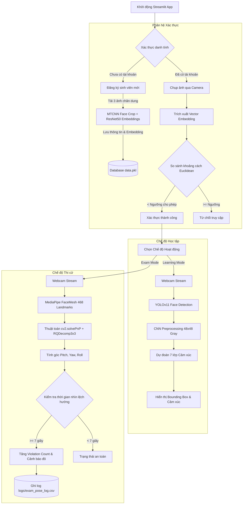

# Hệ Thống Giám Sát Học Tập & Thi Cử Trực Tuyến Thông Minh
### Smart Online Learning & Exam Proctoring System

[](https://www.python.org/)
[](https://streamlit.io/)
[](https://opencv.org/)
[](https://www.tensorflow.org/)
[](https://github.com/ultralytics/ultralytics)
[](https://developers.google.com/mediapipe)

> Dự án thuộc môn học **Khoa học Dữ liệu (Data Science - IT4930)** - Đại học Bách Khoa Hà Nội (HUST).

---

## 📌 1. Giới thiệu tổng quan

Trong bối cảnh học tập từ xa và thi trực tuyến ngày càng phổ biến, việc đảm bảo tính nghiêm túc, chống gian lận trong phòng thi cũng như theo dõi mức độ tương tác, tập trung của sinh viên trong giờ học là một thách thức lớn.

Dự án **Smart Proctoring & Learning Monitor** cung cấp một giải pháp toàn diện bằng cách ứng dụng Thị giác máy tính (Computer Vision) và Học sâu (Deep Learning) trên nền tảng giao diện tương tác thời gian thực Streamlit:
1. **Xác thực danh tính (Face Verification):** Đảm bảo đúng sinh viên tham gia học/thi thông qua nhận diện khuôn mặt và đối chiếu vector embedding.
2. **Giám sát học tập (Learning Mode):** Phân tích cảm xúc khuôn mặt theo thời gian thực (hào hứng, tập trung, buồn ngủ, mệt mỏi, v.v.) để hỗ trợ đánh giá chất lượng học tập.
3. **Giám sát thi cử (Exam Mode):** Ước lượng hướng nhìn và tư thế đầu 3D (Head Pose Estimation) để phát hiện hành vi quay cóp, nhìn tài liệu hoặc quay sang các hướng bất thường, tự động ghi nhận nhật ký vi phạm.

---

## 🏗️ 2. Kiến trúc hệ thống & Luồng hoạt động



---

## 🧠 3. Chi tiết các Phân hệ AI

### 3.1. Phân hệ Xác thực danh tính sinh viên (`face_verification`)
- **Mục tiêu:** Định danh chính xác sinh viên dựa trên khuôn mặt, ngăn chặn việc thi hộ hoặc điểm danh hộ.
- **Công nghệ cốt lõi:**
  - **MTCNN (Multi-task Cascaded Convolutional Networks):** Phát hiện vị trí khuôn mặt với độ chính xác cao và loại bỏ nền thừa.
  - **ResNet-50 (Pre-trained on ImageNet/FaceNet):** Trích xuất vector đặc trưng khuôn mặt dạng 2048 chiều.
  - **Euclidean Distance:** So sánh khoảng cách hình học giữa vector embedding ảnh đầu vào và các vector trong cơ sở dữ liệu `data.pkl`.
- **Tính năng nổi bật:**
  - **Đăng ký sinh viên mới:** Chụp 3 góc độ (nhìn thẳng, nghiêng trái, nghiêng phải) để tính vector embedding trung bình ổn định nhất.
  - **Cơ chế Caching Database:** Lưu cache dữ liệu trong bộ nhớ RAM, tự động cập nhật khi file `data.pkl` có thay đổi, giúp tăng tốc độ xác thực.

---

### 3.2. Phân hệ Nhận diện cảm xúc (`face_emotion` - Chế độ Học tập)
- **Mục tiêu:** Theo dõi trạng thái cảm xúc của người học theo thời gian thực để đánh giá mức độ tương tác.
- **Mô hình & Pipeline:**
  1. **YOLOv11 Face (`best.pt`):** Phát hiện nhanh vùng mặt của sinh viên trong khung hình.
  2. **FER CNN Architecture (`model_weights.h5`):** Mạng tích chập tùy chỉnh gồm các khối `Conv2D` + `BatchNormalization` + `MaxPooling2D` + `Dropout` và tầng Fully Connected.
  3. **7 trạng thái cảm xúc phân loại:**
     - 😠 *Angry* (Tức giận)
     - 🤢 *Disgusted* (Ghê tởm)
     - 😨 *Fearful* (Sợ hãi)
     - 😊 *Happy* (Vui vẻ)
     - 😐 *Neutral* (Bình thường / Trung tính)
     - 😢 *Sad* (Buồn rầu)
     - 😲 *Surprise* (Bất ngờ)
- **Tối ưu hiệu năng (Performance Optimization):**
  - **Frame Skipping:** Xử lý mô hình sau mỗi $N$ frames (mặc định bước nhảy 2 frame) giúp duy trì tốc độ khung hình cao (FPS mượt) trên phần cứng thông thường.
  - **Model Warm-up:** Chạy thử dummy tensor ngay khi khởi tạo để tránh tình trạng giật lag ở frame đầu tiên.

---

### 3.3. Phân hệ Ước lượng tư thế đầu & Chống gian lận (`head_pose_estimation` - Chế độ Thi)
- **Mục tiêu:** Phát hiện các hành vi bất thường trong phòng thi trực tuyến như quay sang trái, quay sang phải, cúi xuống nhìn tài liệu hoặc ngẩng lên nhìn xung quanh.
- **Mô hình & Pipeline:**
  1. **MediaPipe FaceMesh:** Trích xuất 468 điểm mốc không gian 3D trên khuôn mặt với độ trễ cực thấp.
  2. **Perspective-n-Point (`cv2.solvePnP`):** Dựa trên 6 điểm mốc 3D chuẩn (đỉnh mũi, cằm, khóe mắt trái/phải, mép miệng trái/phải) để giải bài toán định vị hướng xoay đầu trong không gian máy ảnh.
  3. **Phân rã ma trận quay (`cv2.RQDecomp3x3`):** Tính toán ra 3 góc Euler:
     - **Pitch (Trục X):** Góc cúi gập / ngửa đầu (`Looking Down` / `Looking Up`).
     - **Yaw (Trục Y):** Góc quay mặt sang trái / phải (`Looking Left` / `Looking Right`).
     - **Roll (Trục Z):** Góc nghiêng đầu sang hai bên.
- **Cơ chế xử phạt & Nhật ký:**
  - Khi sinh viên lệch hướng khỏi màn hình (`!= Forward`), bộ đếm thời gian được kích hoạt.
  - Nếu thời gian duy trì tư thế bất thường vượt quá **7 giây** liên tục $\rightarrow$ Hệ thống tính là **1 lần vi phạm**, phát cảnh báo màu trực quan và tự động ghi dòng nhật ký (Timestamp, Trạng thái, Góc xoay, Số lần vi phạm) vào file [exam_pose_log.csv](file:///c:/Users/HP/Desktop/learning/project/HUST/datascience_project/DS-IT4930/logs/exam_pose_log.csv).

---

## 📁 4. Cấu trúc thư mục dự án

```text
DS-IT4930/
├── app.py                              # Ứng dụng web Streamlit chính (UI & Điều khiển luồng)
├── requirements.txt                    # Danh sách các thư viện phụ thuộc của dự án
├── .gitignore                          # Cấu hình bỏ qua các file tạm, cache, môi trường ảo
├── README.md                           # Tài liệu chi tiết hướng dẫn sử dụng và triển khai
│
├── ai_modules/                         # Các phân hệ Trí tuệ Nhân tạo & Thị giác máy tính
│   ├── __init__.py
│   ├── face_verification/              # Phân hệ Nhận diện & Xác thực sinh viên
│   │   ├── __init__.py
│   │   ├── face_recognition.py         # Lớp FaceRecog: Trích xuất embedding & Xác thực
│   │   ├── model_loader.py             # Quản lý nạp model MTCNN và ResNet-50
│   │   └── data/
│   │       ├── data.pkl                # File nhị phân lưu trữ vector đặc trưng sinh viên
│   │       └── Students/               # Thư mục lưu trữ ảnh khuôn mặt đã đăng ký
│   │           └── 20225092/           # Mẫu thư mục sinh viên (MSSV)
│   │
│   ├── face_emotion/                   # Phân hệ Nhận diện Cảm xúc
│   │   ├── __init__.py
│   │   ├── face_emotion.py             # Lớp EmotionDetector (YOLOv11 + CNN 7-class)
│   │   ├── best.pt                     # Trọng số YOLOv11 phát hiện khuôn mặt
│   │   └── model_weights.h5            # Trọng số mạng CNN nhận diện 7 cảm xúc
│   │
│   └── head_pose_estimation/          # Phân hệ Ước lượng tư thế đầu
│       ├── __init__.py
│       └── head_pose_detector.py       # Lớp HeadPoseDetector: MediaPipe Mesh + solvePnP
│
├── logs/                               # Thư mục lưu nhật ký hoạt động
│   └── exam_pose_log.csv               # Bảng log vi phạm tư thế phòng thi
│
└── notebooks/                          # Thư mục Jupyter Notebook phục vụ phân tích & EDA
    └── exploration.ipynb               # Thử nghiệm và trực quan hóa dữ liệu
```

---

## 🚀 5. Hướng dẫn cài đặt & Khởi chạy

### 5.1. Yêu cầu hệ thống
- **Hệ điều hành:** Windows 10/11, macOS hoặc Linux.
- **Python:** Phiên bản Python `3.8` đến `3.11` (khuyến nghị `3.10` hoặc `3.11` để tương thích tốt nhất với TensorFlow và MediaPipe).
- **Phần cứng:** Có tích hợp hoặc kết nối Webcam hoạt động ổn định.

### 5.2. Các bước cài đặt

**Bước 1: Clone kho lưu trữ về máy**
```bash
git clone https://github.com/phunh1901/DS-IT4930.git
cd DS-IT4930
```

**Bước 2: Tạo và kích hoạt môi trường ảo (Khuyến nghị)**
- Trên Windows:
  ```powershell
  python -m venv venv
  .\venv\Scripts\activate
  ```
- Trên macOS/Linux:
  ```bash
  python3 -m venv venv
  source venv/bin/activate
  ```

**Bước 3: Cài đặt các thư viện cần thiết**
```bash
pip install --upgrade pip
pip install -r requirements.txt
```

**Bước 4: Khởi chạy ứng dụng Streamlit**
```bash
streamlit run app.py
```
Sau khi chạy lệnh, trình duyệt web sẽ tự động mở địa chỉ `http://localhost:8501`.

---

## 📖 6. Hướng dẫn sử dụng hệ thống

### Bước 1: Đăng ký / Xác thực danh tính
1. **Đăng ký sinh viên mới (Tab Đăng ký):**
   - Nhập **MSSV** và **Họ và tên**.
   - Tải lên đủ 3 ảnh chân dung chụp ở các góc độ: thẳng mặt, nghiêng nhẹ trái, nghiêng nhẹ phải.
   - Bấm **Lưu đăng ký** để hệ thống tạo vector đặc trưng và lưu vào database.
2. **Xác thực khuôn mặt (Tab Xác thực):**
   - Nhìn thẳng vào webcam và bấm **Chụp ảnh**.
   - Hệ thống sẽ so khớp khuôn mặt với cơ sở dữ liệu. Nếu độ tương đồng đạt chuẩn, sinh viên được chuyển vào màn hình lựa chọn chế độ.

### Bước 2: Chọn Chế độ hoạt động
- **Learning Mode (Học tập):**
  - Bấm **Bắt đầu giám sát** để kích hoạt webcam.
  - Khung hình sẽ hiển thị khuôn mặt được định vị cùng tên cảm xúc hiện tại.
  - Cột bên phải thống kê cảm xúc trực quan.
- **Exam Mode (Giám sát thi cử):**
  - Bấm **Bắt đầu thi** để kích hoạt camera giám sát.
  - Hệ thống vẽ các đường trục hướng nhìn (3D Axis) từ mũi và hiển thị góc xoay $X, Y, Z$.
  - Nếu quay sang trái, phải, cúi xuống quá lâu ($\ge 7$ giây), hệ thống sẽ tăng cảnh báo vi phạm và tự động lưu vào file `logs/exam_pose_log.csv`.
  - Kết thúc buổi thi, nhấn **Nộp bài** để kết thúc quá trình giám sát.

---

## ⚙️ 7. Cấu hình & Tùy chỉnh tham số

Người dùng có thể dễ dàng tùy biến các tham số hoạt động trong mã nguồn:
- **Ngưỡng nhận diện khuôn mặt (`app.py`):**
  ```python
  result = face_recog.verify_from_frame(frame, threshold=50) # Tăng/giảm threshold tùy độ khắt khe
  ```
- **Thời gian tính vi phạm thi (`head_pose_detector.py`):**
  ```python
  # Thay đổi thời gian giới hạn nhìn lệch (mặc định 7 giây)
  HeadPoseDetector(violation_seconds=7, log_file="logs/exam_pose_log.csv")
  ```
- **Tần suất bỏ qua frame cho cảm xúc (`face_emotion.py`):**
  ```python
  emotion_detector.set_skip_frames(2) # 0: xử lý mọi frame (chính xác nhất), 2: xử lý mỗi 3 frames (cân bằng)
  ```

---

## 👥 8. Tác giả & Đóng góp
- **Họ và tên:** Phùng Hữu Phú
- **Khóa / Ngành:** Khoa học Dữ liệu - Đại học Bách Khoa Hà Nội (HUST)
- **Repository:** [https://github.com/phunh1901/DS-IT4930](https://github.com/phunh1901/DS-IT4930)
